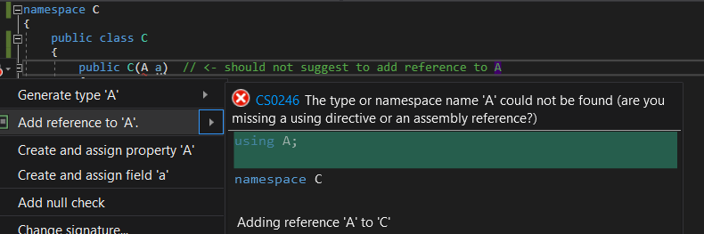

When adding a reference to a class in a project of the current solution, triggering `Add reference to <project>` hangs if the new dependency would create a dependency cycle.

I would expect that cycle to be detected and reported instead.
The reporting `can't add reference to project B in project A because B depends on A` would be very helpful.

